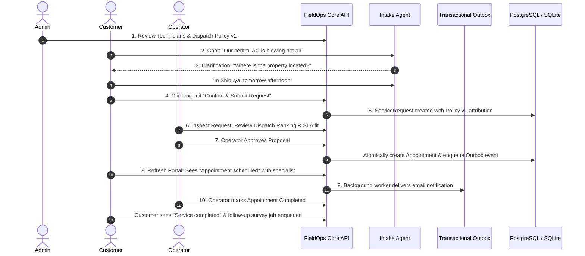

# FieldOps Agent — End-to-End Multi-Role Demo Script

A concise, structured **5–8 minute interview demonstration walkthrough** highlighting the collaborative business lifecycle across **Admin Console**, **Customer Portal**, and **Operator Dashboard**.

---

## Pre-Demo Setup & Demo Accounts

| Role | Portal URL | Demo Credentials | Notes |
| :--- | :--- | :--- | :--- |
| **Admin** | `http://localhost:5173/admin` | `admin@fieldops.com` / `AdminPass123!` | System governance, policies, technicians |
| **Operator** | `http://localhost:5173/` | `operator@fieldops.com` / `Operator123!` | Dispatch explainability, HITL approval, completion |
| **Viewer** | `http://localhost:5173/` | `viewer@fieldops.com` / `Viewer123!` | Read-only operational oversight |
| **Customer** | `http://localhost:5173/customer/login` | `customer@example.com` / `CustomerPass123!` | Conversational intake, draft confirmation, visits |

> [!NOTE]
> Demo accounts and passwords are for **development and evaluation only**. Production deployments initialize zero default passwords and require secure provisioning.

---

## 10-Step Sequential Interview Demonstration (5–8 Minutes)

### Step 1: Admin Governance & Configuration (1 min)
1. Log in to **Admin Console** (`/admin`).
2. Navigate to **Technicians**:
   - Point out active technicians, skill certifications (`HVAC`, `Electrical`, `Plumbing`), and capacity settings.
   - Explain how inactive technicians are automatically excluded from dispatch recommendations.
3. Navigate to **Dispatch Policies**:
   - Inspect active weights (`SLA: 40%`, `Workload: 20%`, `Capacity: 20%`, `Travel: 10%`, `Overtime Penalty: 10%`).
   - Mention that policy versions are immutable and version-attributed to every work order for auditability.

### Step 2: Customer Conversational Intake (1 min)
1. Switch to **Customer Portal** (`/customer/assistant`).
2. Type an initial natural language message:
   > *"The central air conditioner in our Shibuya office is blowing hot air."*
3. Show how the agent:
   - Accurately classifies the trade as **HVAC**.
   - Extracts location as **Shibuya**.
   - Identifies the remaining missing field: **Preferred Visit Time**.

### Step 3: Incremental Clarification & Mid-Dialogue Correction (45 sec)
1. In the chat, type a correction and missing time:
   > *"Actually, we prefer a visit tomorrow afternoon around 2 PM."*
2. Highlight how the agent:
   - Retains previously extracted trade (`HVAC`) and location (`Shibuya`).
   - Merges the preferred time window.
   - Deterministically detects that all required fields are complete.
   - Automatically transitions status to `awaiting_confirmation` and displays the structured Draft Card.

### Step 4: Explicit Customer Confirmation (30 sec)
1. Explain the architectural rule: *Conversations never create tickets automatically on chat messages; explicit customer action is mandatory.*
2. Click the green **"Confirm & Submit Request"** button.
3. Show immediate feedback: Formal ServiceRequest `#ID` is generated via unified `InboundRequestService`.

### Step 5: Operator Dispatch Explainability (1 min)
1. Switch to **Operator Dashboard** (`/`).
2. The newly created ServiceRequest appears immediately in the queue with status `waiting_for_approval`.
3. Open the request detail view:
   - Show the **SLA Badge** (`on_track`, resolution deadline snapshot).
   - Show **Dispatch Explainability Rankings**: Candidate technicians scored and ranked dynamically based on active Admin policy weights.
   - Show the proposed appointment slot and recommended specialist.

### Step 6: Operator HITL Approval & Atomic Scheduling (30 sec)
1. Click **"Approve Proposal"**.
2. Explain the atomic backend transaction:
   - Re-checks slot conflicts with row-level locks.
   - Transitions `ServiceRequest.status = "scheduled"`.
   - Creates the `Appointment` record.
   - Writes an `appointment.created` event into the **Transactional Outbox**.
   - Records an immutable audit log entry.

### Step 7: Customer Appointment Visibility (30 sec)
1. Switch back to **Customer Portal** $\rightarrow$ **Appointments** (`/customer/appointments`).
2. Show that the customer immediately sees their scheduled visit:
   - Arrival window, property location, service trade.
   - Assigned technician display name.
   - Customer-friendly status: `"Appointment scheduled"`.
   - Internal technical parameters (SLA margins, operator notes) remain concealed.

### Step 8: System Observability, Outbox & Audit Trails (1 min)
1. Open **Admin Console** $\rightarrow$ **Audit & Security** (`/admin/audit`):
   - Show the unbroken chronological audit trail:
     `conversation.created` $\rightarrow$ `conversation.submitted` $\rightarrow$ `service_request.created` $\rightarrow$ `appointment.created`.
2. Inspect **Integrations & Outbox**:
   - Point out that the `appointment.created` Outbox event was picked up by the background Celery worker to simulate calendar sync and customer confirmation email.
   - Highlight fault-tolerance: If external email fails, core appointment booking remains intact and resilient.

### Step 9: Service Completion (30 sec)
1. In the **Operator Dashboard**, navigate to the confirmed appointment:
2. Click **"Mark Completed"**.
3. Backend updates both `Appointment` and `ServiceRequest` to `completed` in one transaction and enqueues a follow-up feedback job.

### Step 10: Final State Synchronization (30 sec)
1. Refresh the **Customer Portal**:
   - Customer sees `"Service completed"`.
2. Refresh the **Admin Console** System Health overview:
   - Real-time counters reflect active work orders archived, health healthy, and zero data discrepancies across roles.
