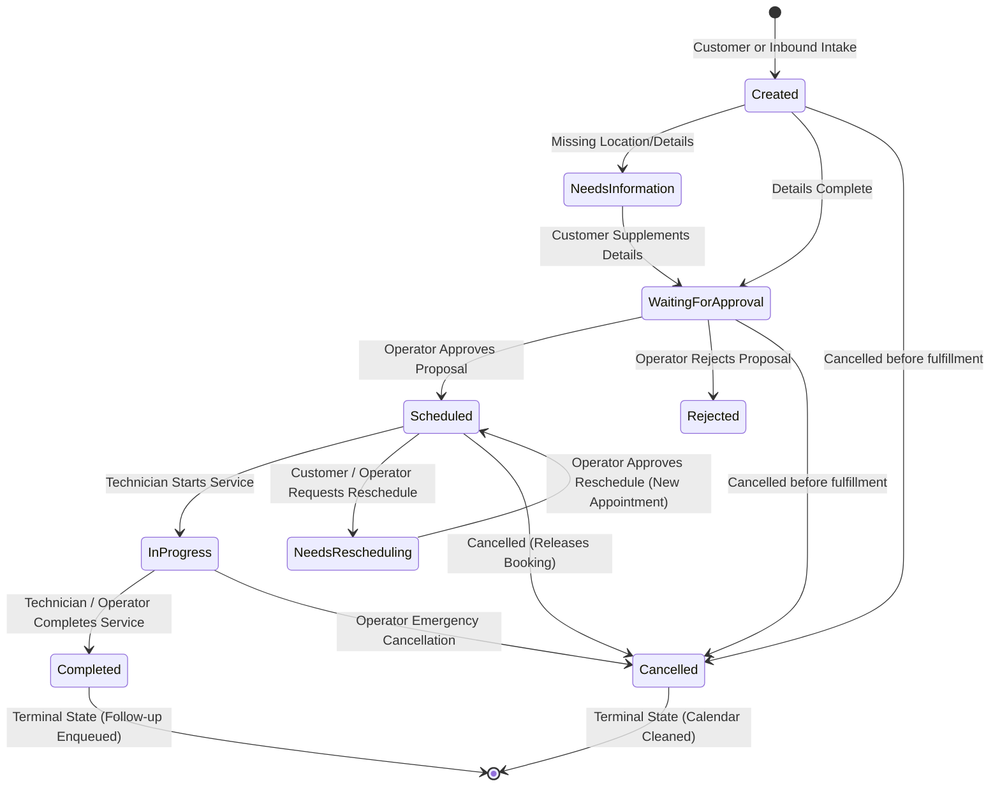
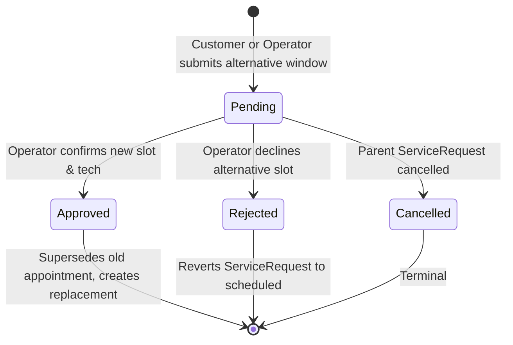

# FieldOps Service Lifecycle Completion (Phase 24)

This document specifies the complete operational lifecycle for **ServiceRequest**, **Appointment**, and **RescheduleRequest** within the FieldOps Agent platform.

---

## 1. Lifecycle Finite State Machines

### 1.1 ServiceRequest & Appointment State Machine

### 1.2 RescheduleRequest Lifecycle

---

## 2. Core Architectural Principles

1. **Centralized Lifecycle Engine (`ServiceLifecycleService`)**:
   - State transition rules and pre-conditions are centralized in `src/fieldops/application/service_lifecycle_service.py`.
   - Ad-hoc database updates in endpoint controllers are strictly eliminated.
2. **Zero Dual States**:
   - `ServiceRequest` and `Appointment` states transition in synchronized transactions.
   - When an Appointment moves to `in_progress` or `completed`, the parent `ServiceRequest` reflects the identical state immediately.
3. **History Preservation via Replacement Chains**:
   - Rescheduling an appointment never mutates or erases the original scheduled record.
   - The prior appointment is marked `cancelled` with `replaced_by_appointment_id = <new_id>`.
   - The replacement appointment records `rescheduled_from_appointment_id = <old_id>`.
4. **Strict Concurrency Protection & Idempotency**:
   - **Double-Complete Idempotency**: Submitting a completion request on an already `completed` appointment returns HTTP 200 with the existing record and zero duplicate outbox events or notifications.
   - **Complete vs. Cancel Race**: When an appointment is `completed`, any cancellation attempt is rejected with HTTP 409 Conflict (`AppointmentAlreadyCompletedError`).
   - **Customer Guardrail**: Customers are prohibited from cancelling or rescheduling an `in_progress` service (HTTP 409 Conflict, `RequestNotCancellableError`).

---

## 3. Dynamic Capability Matrix

Allowable operations are calculated deterministically on the backend based on caller role and entity state:

| Role | Entity State | can_start | can_complete | can_cancel | can_reschedule | can_reassign |
| :--- | :--- | :---: | :---: | :---: | :---: | :---: |
| **Operator / Admin** | `scheduled` | ✅ | ✅ | ✅ | ✅ | ✅ |
| **Operator / Admin** | `in_progress` | ❌ | ✅ | ✅ | ❌ | ❌ |
| **Operator / Admin** | `completed` | ❌ | ❌ | ❌ | ❌ | ❌ |
| **Operator / Admin** | `cancelled` | ❌ | ❌ | ❌ | ❌ | ❌ |
| **Customer** | `scheduled` | ❌ | ❌ | ✅ | ✅ | ❌ |
| **Customer** | `in_progress` | ❌ | ❌ | ❌ | ❌ | ❌ |
| **Customer** | `completed` | ❌ | ❌ | ❌ | ❌ | ❌ |
| **Customer** | `cancelled` | ❌ | ❌ | ❌ | ❌ | ❌ |

---

## 4. Concurrency & Race Resolution Matrix

| Scenario | Initiating Action | Competitor Action | Outcome / Status Code | Invariant Guarantee |
| :--- | :--- | :--- | :--- | :--- |
| **Double Complete** | `POST /appointments/{id}/complete` | `POST /appointments/{id}/complete` | First: 200 OK Second: 200 OK | Idempotent; exactly 1 Outbox event, exactly 1 follow-up job |
| **Complete vs Cancel** | `complete_service()` committed | `cancel_request()` | 409 Conflict (`AppointmentAlreadyCompletedError`) | Completed work order cannot be cancelled |
| **Cancel vs Complete** | `cancel_request()` committed | `complete_service()` | 409 Conflict (`AppointmentAlreadyCancelledError`) | Cancelled work order cannot be completed |
| **Double Cancel** | `POST /appointments/{id}/cancel` | `POST /appointments/{id}/cancel` | First: 200 OK Second: 200 OK | Idempotent; exactly 1 cancellation Outbox event |
| **Customer In-Progress Cancel** | Technician calls `start_service()` | Customer clicks Cancel | 409 Conflict (`RequestNotCancellableError`) | On-site work in progress cannot be aborted by customer portal |

---

## 5. API Reference

| Endpoint | Method | Role | Description |
| :--- | :--- | :--- | :--- |
| `/appointments/{id}` | GET | All | Returns appointment details, notes, links, and calculated `capabilities` |
| `/appointments/{id}/start` | POST | Operator/Tech | Transitions appointment & request from `scheduled` to `in_progress` |
| `/appointments/{id}/complete` | POST | Operator/Tech | Transitions to `completed`, stores resolution summary & completion notes |
| `/appointments/{id}/cancel` | POST | Operator/Admin | Cancels appointment and linked service request |
| `/appointments/{id}/reassign` | POST | Operator/Admin | Reassigns appointment to target or optimal candidate technician |
| `/customer/requests/{id}/cancel` | POST | Customer | Cancels request if not in-progress or completed |
| `/customer/requests/{id}/reschedule` | POST | Customer | Submits a `RescheduleRequest` with requested alternative window |
| `/reschedule-requests` | GET | Operator/Admin | Lists pending/reviewed reschedule requests |
| `/reschedule-requests/{id}/approve` | POST | Operator/Admin | Approves reschedule, generates replacement appointment with historical link |
| `/reschedule-requests/{id}/reject` | POST | Operator/Admin | Rejects reschedule, reverts ServiceRequest status |

---

## 6. Observability & Telemetry

Prometheus metrics instrumenting the lifecycle engine:
- `fieldops_requests_completed_total`: Monotonically increasing counter of successfully completed work orders.
- `fieldops_requests_cancelled_total`: Monotonically increasing counter of cancelled work orders.
- `fieldops_reschedule_requests_total`: Total reschedule requests initiated by customers or operators.
- `fieldops_reschedule_success_total`: Total approved reschedule requests resulting in replacement appointments.
- `fieldops_reassignments_total`: Total technician reassignments performed.
- `fieldops_appointments_in_progress`: Real-time gauge of appointments actively in progress on-site.
