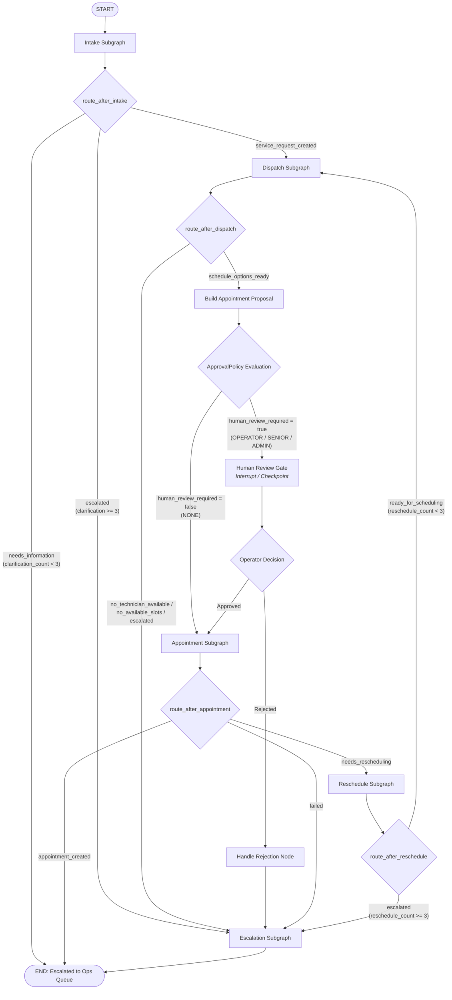
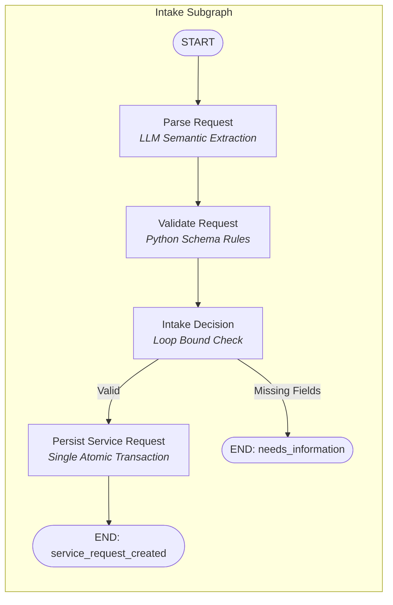
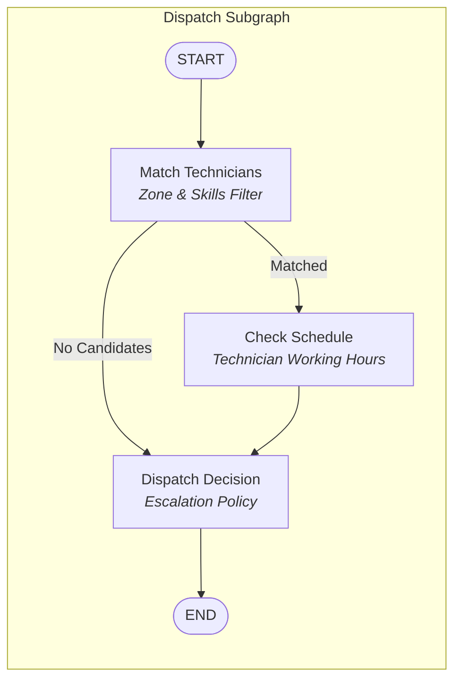
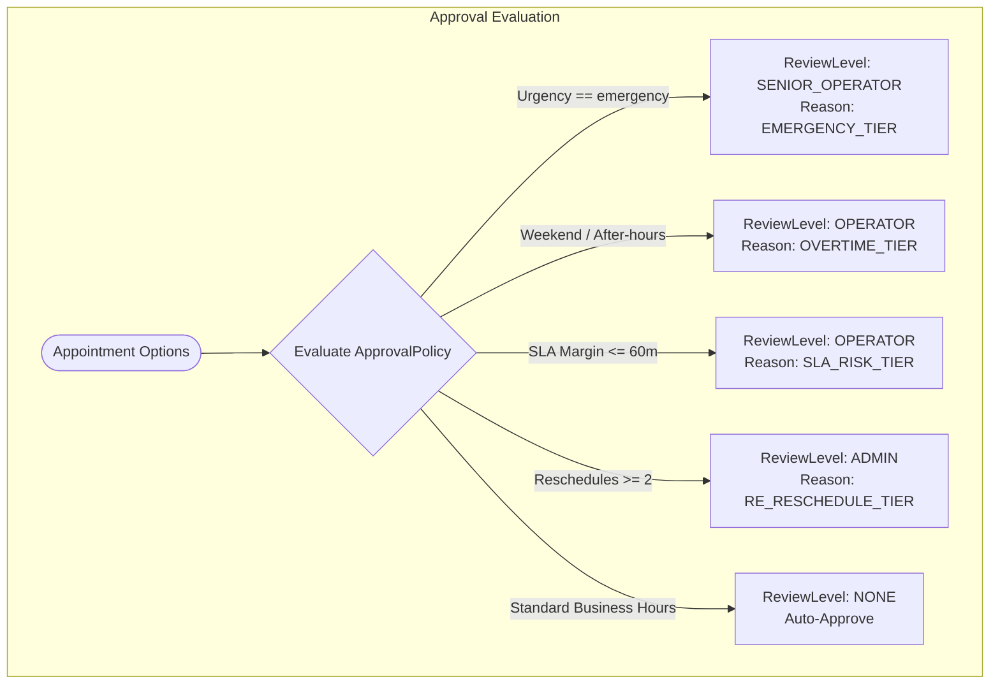
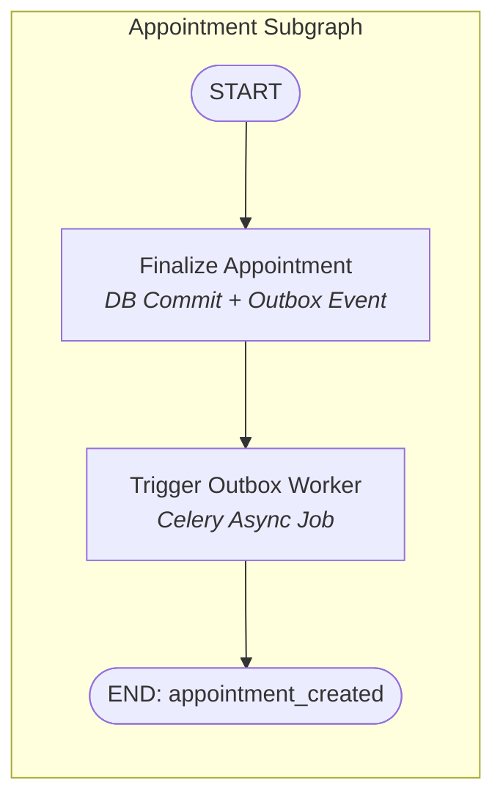
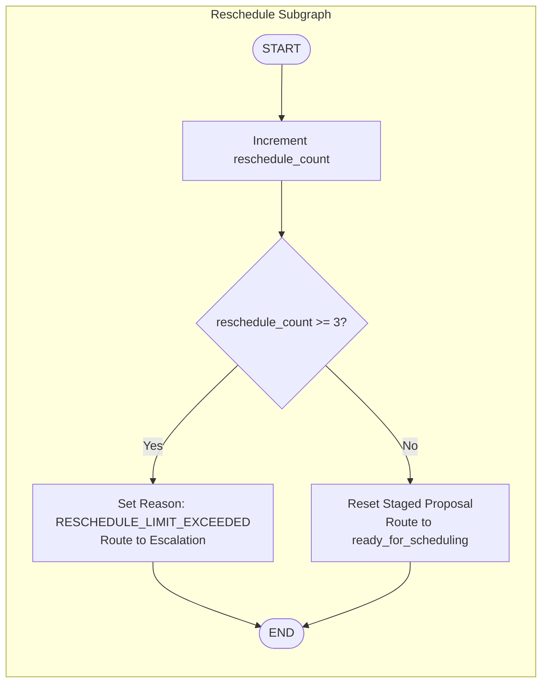
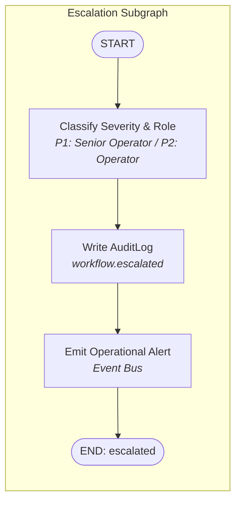
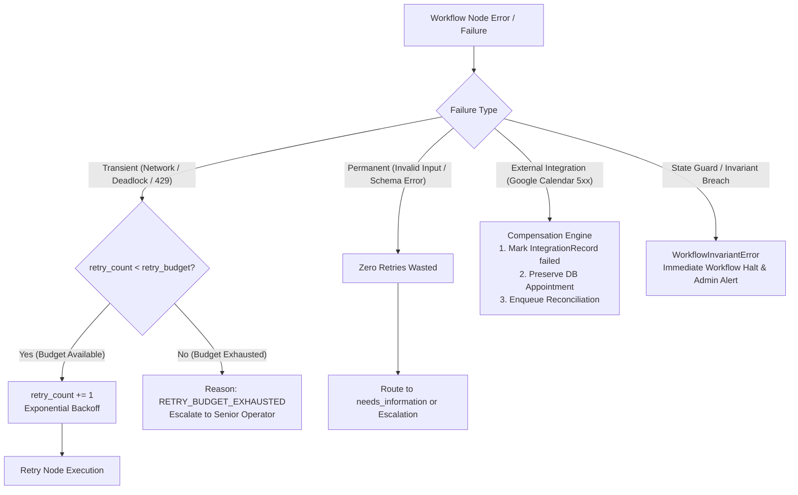
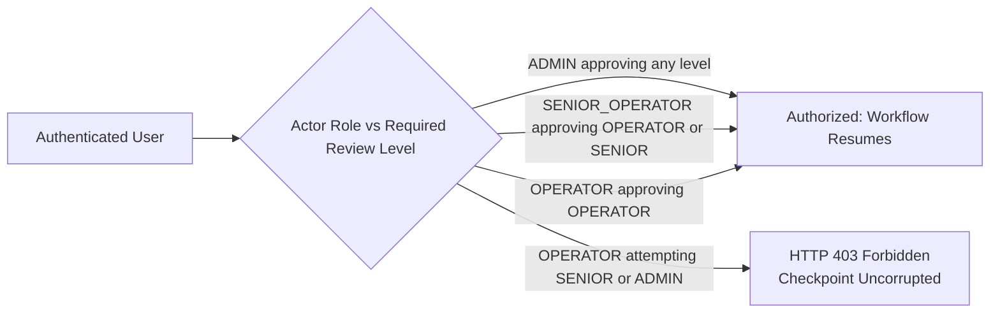

# FieldOps Agentic Workflow v2 Architecture

This document describes the Phase 28 upgrade of the FieldOps Agent workflow engine: **Policy-Driven + Dynamic Routing + Recoverable + Explainable Agentic Workflow**.

---

## 1. High-Level Main Graph Architecture

The workflow orchestrates business subgraphs and human intervention gates using a single, unified `FieldServiceState` schema.

---

## 2. Subgraph Specifications

### 2.1 Intake Subgraph (`intake_subgraph`)
Handles customer message extraction, semantic parsing, deterministic validation, loop bounding, and atomic database persistence.

### 2.2 Dispatch Subgraph (`dispatch_subgraph`)
Evaluates geographical technician availability, required skill match, and schedule slot availability with deterministic policies.

### 2.3 Approval Subgraph & HITL Review Gate
Evaluates urgency tiers, overtime, SLA risks, and prior reschedules to determine required human reviewer role.

### 2.4 Appointment Subgraph (`appointment_subgraph`)
Ensures Core Business Fact priority: transactional database commit occurs first, staging Outbox events for asynchronous external sync.

### 2.5 Reschedule Subgraph (`reschedule_subgraph`)
Bounds rescheduling cycles to prevent infinite looping when schedule conflicts occur.

### 2.6 Escalation Subgraph (`escalation_subgraph`)
Classifies failure reasons, records structured audit trail, and attributes operational ticket to correct role queue.

---

## 3. Failure Classification & Recovery Flow

---

## 4. Multi-Level Human Review Authorization Matrix

Resumption of an interrupted workflow (`POST /service-requests/{id}/approval`) verifies the actor's role against the required review level:

| Review Level Required | Operator Allowed? | Senior Operator Allowed? | Admin Allowed? |
|---|:---:|:---:|:---:|
| `NONE` (Auto) | Yes | Yes | Yes |
| `OPERATOR` | **Yes** | **Yes** | **Yes** |
| `SENIOR_OPERATOR` | No | **Yes** | **Yes** |
| `ADMIN` | No | No | **Yes** |
